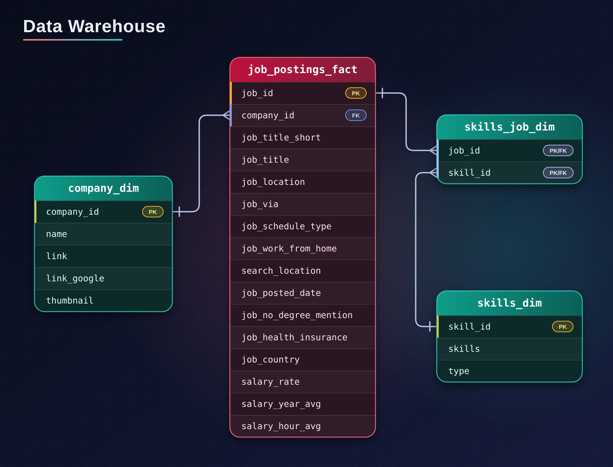

# 🔍 Exploratory Data Analysis w/ SQL: Data Scientist Job Market in Germany


A SQL project analyzing the **data scientist job market in Germany** using real world job posting data. It demonstrates my ability to **write production-quality analytical SQL, design efficient queries, and turn business questions into data-driven insights**.

---

## 🧾 Executive Summary (For Hiring Managers)

- ✅ **Project scope:** Built **3 analytical queries** that answer key questions about the German data scientist job market  
- ✅ **Data modeling:** Used **multi-table joins** across fact and dimension tables to extract insights  
- ✅ **Analytics:** Applied **aggregations, filtering, and sorting** to find top skills by demand, salary, and overall value  
- ✅ **Outcomes:** Delivered **actionable insights** on Python/SQL/R dominance, Azure vs AWS, and which skills carry a pay premium (Spark, Java, GCP)

If you only have a minute, review these:

1. [`01_most_demanded_skills_for_data_scientists.sql`](./01_most_demanded_skills_for_data_scientists.sql) – demand analysis with multi-table joins  
2. [`02_highest_paid_skills_for_data_scientists.sql`](./02_highest_paid_skills_for_data_scientists.sql) – salary analysis with aggregations  
3. [`03_optimal_skills.sql`](./03_optimal_skills.sql) – combined demand/salary optimization query  

---

## 🧩 Problem & Context

Job market analysts and job seekers need to answer questions like:

- 🎯 **Most in-demand:** *Which skills are most in-demand for data scientists in Germany?*  
- 💰 **Highest paid:** *Which skills command the highest salaries?*  
- ⚖️ **Best trade-off:** *What is the optimal skill set balancing demand and compensation?*  

This project analyzes a **data warehouse** built using a star schema design. The warehouse structure consists of:



- **Fact Table:** `job_postings_fact` - Central table containing job posting details (job titles, locations, salaries, dates, etc.)
- **Dimension Tables:** 
  - `company_dim` - Company information linked to job postings
  - `skills_dim` - Skills catalog with skill names and types
- **Bridge Table:** `skills_job_dim` - Resolves the many-to-many relationship between job postings and skills

By querying across these interconnected tables, I extracted insights about skill demand, salary patterns, and optimal skill combinations for data science roles in Germany.  

---

## 🧰 Tech Stack

- 🐤 **Query Engine:** DuckDB for fast OLAP-style analytical queries  
- 🧮 **Language:** SQL (ANSI-style with analytical functions)  
- 📊 **Data Model:** Star schema with fact + dimension + bridge tables  
- 🛠️ **Development:** VS Code for SQL editing + Terminal for DuckDB CLI  
- 📦 **Version Control:** Git/GitHub for versioned SQL scripts  

---

## 📂 Repository Structure

```text
1_EDA/
├── 01_most_demanded_skills_for_data_scientists.sql   # Demand analysis query
├── 02_highest_paid_skills_for_data_scientists.sql    # Salary analysis query
├── 03_optimal_skills.sql                             # Combined demand/salary optimization
└── README.md                                         # You are here
```
---

## 🏗 Analysis Overview

### Query Structure

1. **[Most Demanded Skills](./01_most_demanded_skills_for_data_scientists.sql)** – Identifies the 10 most in-demand skills for Data Scientist positions in Germany
2. **[Highest Paid Skills](./02_highest_paid_skills_for_data_scientists.sql)** – Ranks the top 10 skills by median salary (skills with at least 10 postings), alongside skill frequency
3. **[Optimal Skills](./03_optimal_skills.sql)** – Calculates an optimal score using the natural log of demand combined with median salary to identify the most valuable skills to learn (top 20, skills with at least 25 postings)

### Key Insights

#### 🎯 Most in-demand skills
- 🧠 Core languages: Python leads with **647** postings, nearly 2x SQL (**329**) and 2.3x R (**277**)
- ☁️ Cloud platforms: Azure (**145**) leads AWS (**113**), reflecting Germany's enterprise-heavy market
- 📊 Communication: Tableau (**104**) is the only BI tool in the top 10
- 🤖 ML toolkit: PyTorch (96), Pandas (94), Scikit-learn (92), and TensorFlow (90) cluster tightly, so no single framework dominates

#### 💰 Highest paid skills
- 🔥 Big data: **Spark** pays the most (median **€171,121**) with solid demand (62 postings)
- 🧱 Engineering languages and cloud: Java and C# (162,000), GCP and R (158,891) follow
- 📉 SQL is the most requested skill in this ranking (329) but has the lowest median (119,553), so it is a baseline skill rather than a pay differentiator

#### ⚖️ Optimal skills (demand + salary)
- 🥇 **R** ranks #1 (score **0.89**): high pay (158,891) plus strong demand (277)
- 🥈 **Python** ranks #2 (0.77) because of demand (647), not pay. It is a must-have foundation, not a salary booster
- 🚀 Spark, Java, and GCP combine top-tier pay with moderate demand, making them the best skills to add on top of the basics
- 🗑️ Excel (0.16) and SAP (0.17) rank last and are low-value skills to prioritize

#### 🗂 Skills by category

| Category | Takeaway |
|---|---|
| **Programming languages** | R, Python, and Java score best. Go is solid, while SAS, JavaScript, and C++ score lower |
| **Big data & cloud** | Spark and GCP pay the most. Azure and Snowflake have a lower median (88,956) |
| **ML libraries** | Pandas, Scikit-learn, and TensorFlow tie at 0.40: high demand, modest median |
| **BI & visualization** | Tableau leads (0.55), then Power BI (0.33) and Excel (0.16) |
| **Tools & enterprise software** | Git scores well (0.61), while SAP has the lowest median (43,200) |

> **Suggested learning path:** build the foundation with Python, SQL, and R, then add Spark and a cloud platform (GCP or Azure) to move into higher pay tiers.

---

## 💻 SQL Skills Demonstrated

### Query Design & Optimization

- **Complex Joins**: Multi-table `INNER JOIN` operations across `job_postings_fact`, `skills_job_dim`, and `skills_dim`
- **Aggregations**: `COUNT()`, `MEDIAN()`, `ROUND()` for statistical analysis
- **Filtering**: Boolean logic with `WHERE` clauses and multiple conditions (`LOWER(job_location) = 'germany'`, `LOWER(job_title_short) = 'data scientist'`)
- **Sorting & Limiting**: `ORDER BY` with `DESC` and `LIMIT` for top-N analysis

### Data Analysis Techniques

- **Grouping**: `GROUP BY` for categorical analysis by skill
- **Mathematical Functions**: `LN()` for natural logarithm transformation to normalize demand metrics
- **Calculated Metrics**: Derived optimal score combining log-transformed demand with median salary
- **HAVING Clause**: Filtering aggregated results to remove small samples (skills with >= 10 postings in query 2, >= 25 in query 3)
- **Case-insensitive matching**: `LOWER()` to make location and job title filters robust
- **NULL Handling**: `MEDIAN()` ignores postings without a listed salary, so medians are based on salaried rows only

